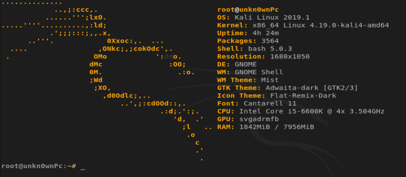
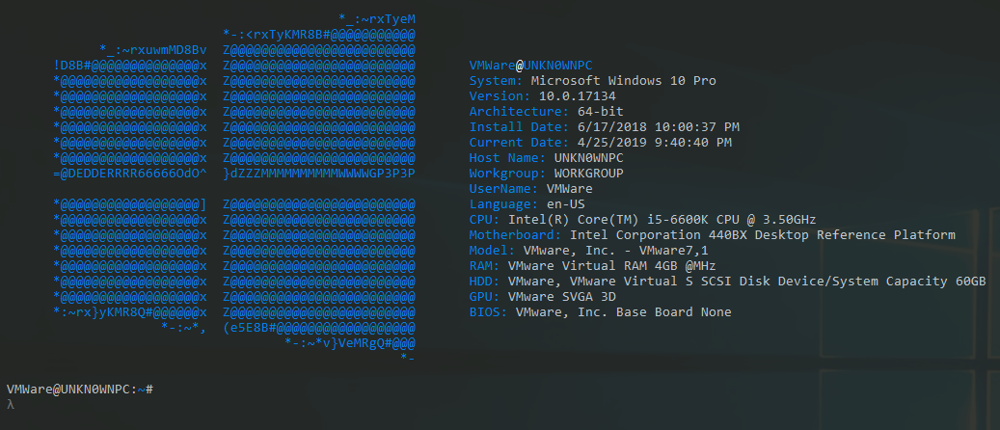

# cmderfetch
Screenfetch for cmder windows console

Get the same feel of Linux consoles with applications like screenfetch, neofetch or linux_logo in Windows 8+ using a user PowerShell script for Cmder

#### Linux console using screefetch

#### Windows cmder console using PowerShell script

### Installation
1- Download the latest version of cmder [HERE](https://cmder.net/) 
2- Execute the cmder console and go to settings 
3- Go to General options and select the startup task for **{PowerShell::PowerShell}** or **{PowerShell::PowerShell as Admin}** and save settings 
4- Copy **"user_profile.ps1"** file into **"cmder\config"** folder 
5- Execute the cmder console and you should see the header popup 

